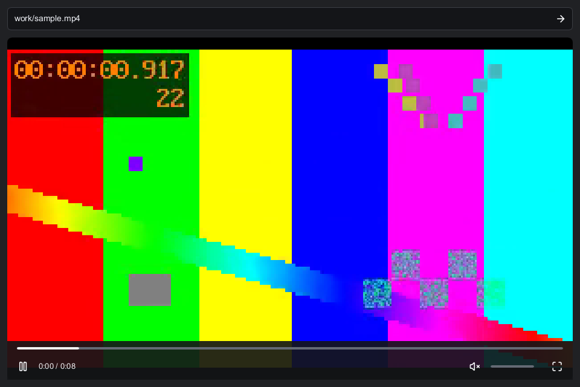

# Rust Media

Video playback for Rust apps. Open a local file or a supported video link, play audio, and get timestamped RGBA frames to draw in your own UI.

Rust Media decodes H.264 in Rust and plays AAC through Rodio and Symphonia. The library runs without a windowing toolkit; an optional Slint player is included for trying it out. It does not require a WebView, FFmpeg installation, or external downloader.



## Add it to your app

Requires Rust 1.92 or newer. Install from Git; the crate is not published on crates.io. The API is pre-1.0.

```toml
[dependencies]
rust-media = { git = "https://github.com/coah80/rust-media", rev = "1813793872ca51873f183939af2ac72b80b9c1b8" }
```

`Player` runs playback on a worker thread. Create one and keep it alive for as long as you need playback.

```rust
use rust_media::Player;

let player = Player::new();
player.load("clip.mp4".into());
player.set_volume(0.5);
```

Call `player.snapshot()` from your application's event loop. Each snapshot includes playback status, position, duration, buffered progress, and an optional frame. Upload the frame's `rgba` bytes using its `width` and `height` to display it in your UI.

A snapshot takes the newest available frame. Retain your previous image when `pixels` is `None`. Check `Status::Failed` and `snapshot.error` to report playback errors.

Use `pause(bool)`, `seek(seconds)`, and `set_volume(0.0..=1.0)` for controls. Calling `load()` again replaces the current video. Call `stop()` when an embed closes or leaves your view, or drop the player when you no longer need it.

For direct access to decoding and networking, see `decode::MediaVideo`, `player::MediaReader`, `http::RemoteFile`, and `providers::resolve`. Generate the API docs with `cargo doc --no-deps --open`.

## Try the player

```sh
git clone https://github.com/coah80/rust-media.git
cd rust-media
cargo run --release --locked --features native -- path/to/clip.mp4
```

Pass a YouTube, Streamable, or FixupX URL instead of a file path, or run without an argument to paste one into the window. The player includes seeking, volume, mute, fullscreen, and a buffered-progress bar.

Space pauses or resumes. Left and Right seek five seconds. M mutes, F toggles fullscreen, and Escape exits fullscreen.

Windows builds need the MSVC toolchain. macOS needs Xcode command-line tools. Linux needs ALSA and windowing development packages; see [build dependencies](CONTRIBUTING.md#checks). Windows x64 playback has been tested with both the software and femtovg renderers. Current macOS and Linux playback remains unverified.

## Supported media

| Source | Support |
| --- | --- |
| Local files | H.264 MP4/MOV, including fragmented MP4, with optional AAC audio |
| Direct media URLs | HTTPS MP4/MOV from arbitrary public domains on port 443, including links without file extensions |
| FixupX / FxTwitter | First video in a public post |
| Streamable | Public share and embed links with an available MP4 stream; see [integration details](docs/streamable.md) |
| YouTube | Public recorded H.264/AAC videos, timestamp links, and `/clip/` links with their start and end boundaries |
| Imgur | Individual video links, `.gifv`, and `.mp4`; albums and galleries are unsupported |
| GIPHY | `/gifs/` and `/embed/` links through their MP4 rendition; no transparency or automatic looping |

Video decoding uses the CPU. Input dimensions are limited to 1920 pixels on either side, and output frames fit within 1280 × 720. Local and ordinary direct files are limited to 2 GiB. Individual compressed samples are limited to 8 MiB.

Direct links must point to media, not a webpage containing a player. Media requests reject credentials, private/reserved IP addresses, and DNS answers containing non-public addresses. Redirects get the same checks. Media connections use a validating DNS resolver and ignore environment proxy settings so a proxy cannot bypass those checks. Existing provider adapters still validate their own metadata URLs before opening media.

WebM, VP9, AV1, HEVC, HLS, DRM, subtitles, live streams, hardware decoding, and adaptive quality switching are not supported. Color conversion uses limited-range BT.601; there is no HDR or color-management pipeline. MP4 files with multiple edit segments or multiple runs per track fragment are rejected.

YouTube resolution uses a Rust JavaScript interpreter, Boa, and a Rust SWC preprocessor. It uses no account credentials or browser session. Provider changes can break link resolution; see [YouTube behavior and limits](docs/youtube.md).

## Streaming and memory

Normal remote playback starts after metadata and initial media blocks arrive. Reads use 512 KiB HTTP ranges. No video file is saved to disk.

YouTube videos up to 20 minutes prefetch into a shared RAM cache while playing, within a 128 MiB combined-media limit. Longer videos use ordinary range reads with one block per reader and a 2 GiB limit per media file. Other direct media uses those same range reads. If a server ignores range requests, the file must fit within 32 MiB. YouTube's SABR fallback still requires the complete clip in RAM before playback and retains its 20-minute and 128 MiB limits.

YouTube timestamp links start at the requested source time. Clips have a timeline limited to their segment. Deep starts can be slow because the AAC demuxer scans preceding fragment metadata. The current range-only buffered-progress value does not measure downloaded coverage. See [link playback checks](docs/link-playback.md) for exact results and remaining work.

Pausing or reaching the end keeps playback resources available for replay. Stopping, replacing, or dropping the player cancels loading and releases its playback resources after the worker exits that playback session. Cleanup is asynchronous. Any reader or progress handles retained by your app can keep their shared cache alive, and the process allocator may retain freed memory for reuse.

## Tests and measurements

The [Windows benchmark report](docs/benchmark-2026-09-11.md) records startup times, memory usage, complete video decodes, repeated seeks, and player controls. Tests compare presentation timestamps and decoded pixels, and cover cancellation, malformed media, and resource limits.

```sh
cargo test --locked --all-features
cargo clippy --locked --all-targets --all-features -- -D warnings
cargo run --release --locked --features native -- --probe-all tests/fixtures/pattern.mp4
```

`--probe` decodes up to 60 video frames. `--probe-all` decodes all video frames and AAC samples. Both run without a window or audible playback. Listening quality, perceptual audio/video sync, and sustained bandwidth starvation still need testing.

See [contributing](CONTRIBUTING.md) for the full check list and bug-report guidance.

## License

Project code is [MIT](LICENSE). Dependencies have their own licenses, including the optional Slint UI. See [third-party components](THIRD_PARTY.md) for details.
